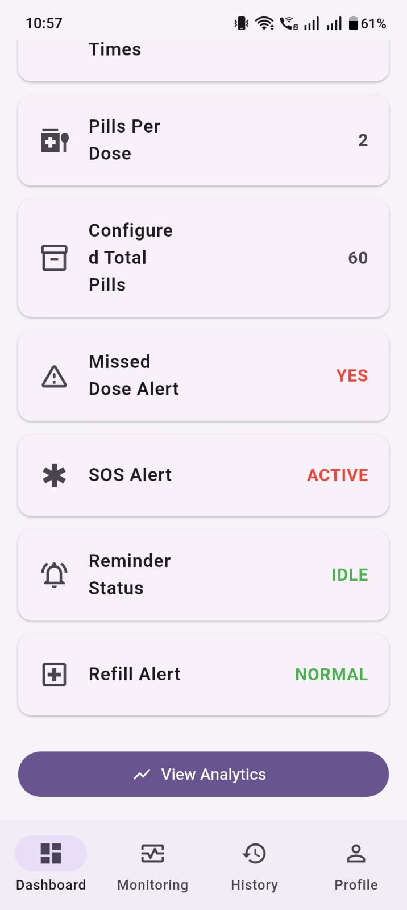
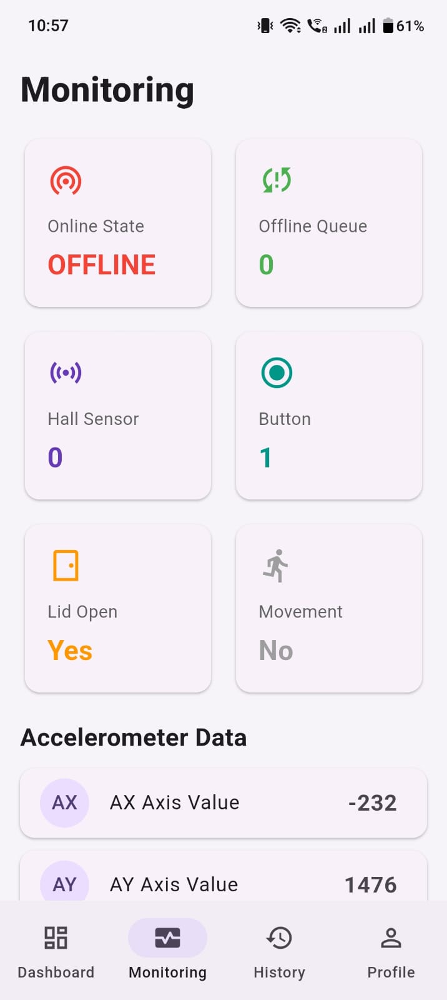

# Smart Medication Adherence Kit

## Overview
An IoT-based healthcare solution that helps elderly patients take medicines on time and allows caregivers to monitor adherence remotely.

## Features
- Medication reminders
- Caregiver notifications
- Real-time monitoring
- Dose history tracking
- Browser-based simulator

## Screenshots

### Dashboard

### Monitoring

### Device

## Project Files
- Simulator: simulator/medkit_simulator.html
- Report: docs/project report final.pdf
- Demo Video: videos/Demo.mp4

## Tech Stack
- HTML
- CSS
- JavaScript
- Firebase
- ESP32